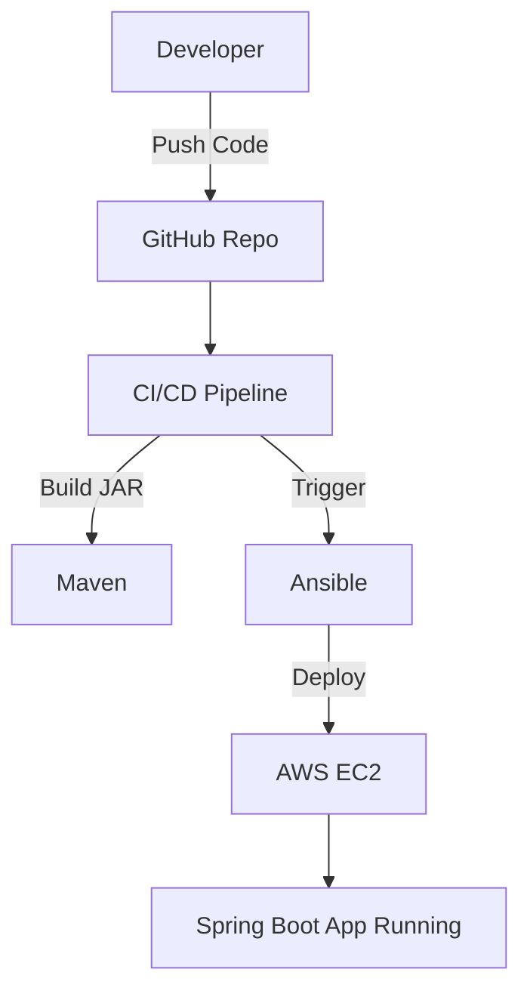

# 🚀 Ansible Java Deployment on AWS

This project demonstrates end-to-end deployment of a Java Spring Boot application on AWS EC2 using Ansible automation and CI/CD practices.

---

## 📌 Project Overview

- Built a **Java Spring Boot application**
- Used **Maven** for dependency management and build
- Generated executable **JAR file**
- Automated deployment using **Ansible**
- Deployed application on **AWS EC2**
- Integrated **CI/CD workflow using GitHub Actions / AWS CodeBuild**

---

## 🛠️ Tech Stack

- Java (Spring Boot)
- Maven
- Ansible
- AWS EC2
- GitHub Actions / CodeBuild
- Linux (Ubuntu)

---

## 📂 Project Structure
.
├── .github/workflows # CI/CD pipeline configuration
├── src/ # Application source code
├── target/ # Compiled JAR file
├── buildspec.yml # AWS CodeBuild configuration
├── pom.xml # Maven dependencies
├── app.log # Application logs


---

---

## ⚙️ How It Works

1. Developer pushes code to GitHub
2. CI/CD pipeline gets triggered
3. Maven builds the project and generates JAR
4. Ansible playbook runs deployment steps:
   - Connects to EC2
   - Copies JAR file
   - Starts application
5. Application runs on AWS EC2 instance

---

## 🚀 Run Locally

### 1. Clone the Repository

```
bash command :

git clone https://github.com/AshishKarad/ansible-java-deployment-aws.git
cd ansible-java-deployment-aws

---
## 2. Build the Application

bash command :

mvn clean package
---
## 3. Run the Application

bash command

java -jar target/*.jar
---
☁️ Deployment Steps (Ansible)

Install Ansible on control node & Configure inventory with EC2 IP

Run playbook:

ansible-playbook deploy.yml

📈 Features

Automated deployment using Ansible
CI/CD integration
Scalable AWS-based deployment
Clean and structured project setup

## 📊 Architecture Diagram


## 👨‍💻 Author

**Ashish Karad**  
DevOps Engineer | AWS | CI/CD | Automation

## ⭐ Support

If you like this project, give it a ⭐ on GitHub!


